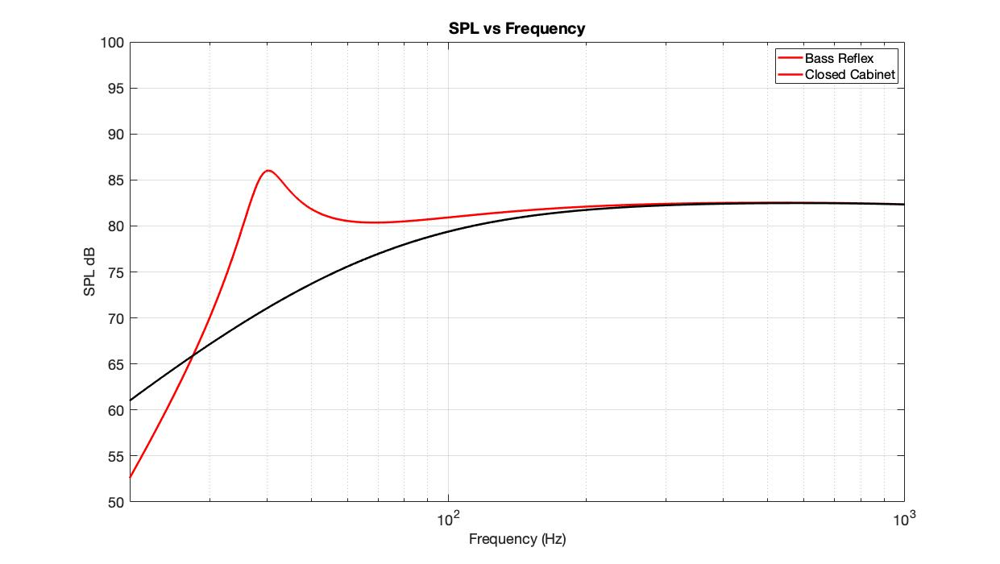
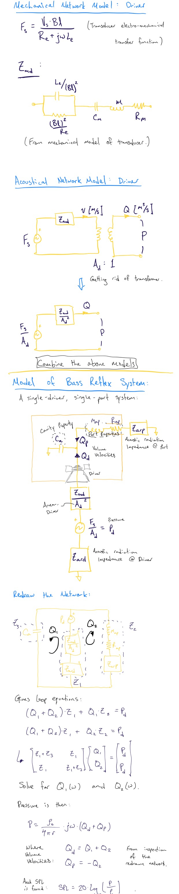

# single_driver_br_python
Modeling a single-driver unported/ported speaker enclosure in Python using a hybrid Thiele-Small model. Below is the output of the MatLab script I wrote to solve the same problem.

The goal of this project is to reproduce this using Python (which doesn't require a license) so that I can use it in the future.

## Setup
Using a single driver in a simple box enclosure:
- Thiele-Small parameters can be obtained from the driver spec sheet and box dimensions.
- Physical parameters obtained from constants at STP.
- We expect that Helmholtz resonance will provide the "bass reflex" boosting SPL of the ported enclosure at low frequencies.

## Methods
From Thiele-Small:

From Acoustical Lumped Networks:
- Assume devices are small compared to λ.
- Treated as hydraulic systems, with air being the fluid. (Ignoring compressibility of air)

Mechanical : 
Electrical : 
Acoustical : 

See handwritten notes for full solution.

